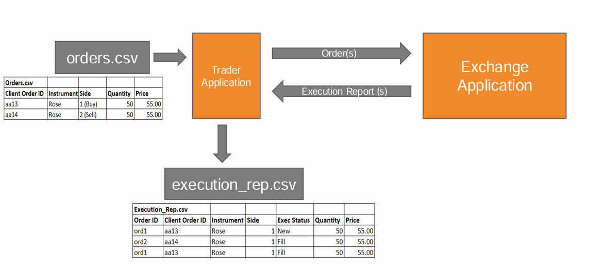

# Flower Exchange System (C++)

<a href="https://isocpp.org/"></a>
<a href="https://cmake.org/"></a>
<a href="https://github.com/features/actions"></a>
<a href="https://code.visualstudio.com/"></a>


## Overview

This project implements a simplified **Flower Trading Exchange System**, similar to a stock exchange matching engine.

The system reads buy and sell orders from a CSV file, processes them using an **order matching engine**, and generates execution reports.
> Developed as the finale project of the C++ workshop series conducted by LSEG.
---

## System Architecture



* **Input**: `orders.csv`
* **Processing**: Exchange Engine (Order Book + Matching Engine)
* **Output**: `execution_rep.csv`

---

## Features

### ✅ Order Validation

Each order is validated before processing. An order is **rejected** if any of the following conditions fail:

* Missing required fields

* Invalid **Instrument**
  → Allowed: `Rose, Lavender, Lotus, Tulip, Orchid`

* Invalid **Side**
  → `1 = Buy`, `2 = Sell`

* Invalid **Price**
  → Must be **greater than 0**

* Invalid **Quantity**

  * Must be a **multiple of 10**
  * Minimum = **10**
  * Maximum = **1000**

---

### 📊 Price-Time Priority

Orders are prioritized based on:

1. **Price priority**
2. **Time priority (FIFO)**

#### Buy Side:

* Higher price → Higher priority

#### Sell Side:

* Lower price → Higher priority

---

### 🔄 Order Matching Engine

The system matches incoming orders against existing orders in the order book.

#### Matching Rules:

* **Buy orders** match with the **lowest sell price**
* **Sell orders** match with the **highest buy price**

#### Matching Conditions:

* Buy Price ≥ Sell Price
* Sell Price ≤ Buy Price

---

### 🔹 Order Execution Types

* **New (0)**
  → No match found, order added to order book

* **Rejected (1)**
  → Failed validation

* **Fill (2)**
  → Order completely matched

* **Partial Fill (3)**
  → Order partially matched

---

### ⚡ Matching Scenarios

* Full match (exact quantity)
* Partial match (remaining quantity stays in book)
* Multiple matches (one order matches multiple orders)

---

### 💰 Execution Price Rule

* Trade price is determined by the **existing order in the order book** (passive order), not the incoming order.

---

### 📄 Execution Report Generation

Each processed order generates one or more execution reports with:

* Order ID (system-generated)
* Client Order ID
* Instrument
* Side
* Price
* Quantity
* Status (0,1,2,3)
* Reason (if rejected)
* Transaction Timestamp

---

### 📁 CSV Input / Output

* Reads orders from: `orders.csv`
* Writes results to: `execution_rep.csv`

---

## 🔁 System Flow

```
Read orders.csv
      ↓
Validate Order
      ↓
Reject OR Process
      ↓
Select Order Book
      ↓
Match Order
      ↓
Update Order Book
      ↓
Generate Execution Report(s)
      ↓
Write execution_rep.csv
```

---


---

## 🛠️ How to Compile & Run

### Prerequisites

- **C++ Compiler** (e.g., GCC, Clang, or MSVC)
- **CMake** (version 3.10 or higher recommended)

### Build Steps

1. **Clone or download this repository.**
2. **Open a terminal and navigate to the project root directory.**
3. **Create a build directory:**
  ```sh
  mkdir build
  cd build
  ```
4. **Run CMake to generate build files:**
  ```sh
  cmake ..
  ```
5. **Build the project:**
  ```sh
  cmake --build .
  ```

### Running the Program

After building, an executable (e.g., `LSEG_Flower_Exchange.exe` on Windows) will be created in the `build` directory.

To run the program:

```sh
./LSEG_Flower_Exchange.exe
```

Make sure your input file (e.g., `orders.csv`) is in the correct location as expected by the program.

The output (e.g., `execution_rep.csv`) will be generated in the appropriate directory after execution.

---

## 🚀 Key Highlights

* Simulates real-world trading systems
* Implements price-time priority matching
* Handles multiple order books efficiently
* Supports partial and multi-level matching
* Designed for performance and scalability

---

## 👥 Contributors

* [Wimukthi Madushan](https://github.com/WimukthiMadushan)
* [Akindu Delgahagoda](https://github.com/AkinduID)

---
